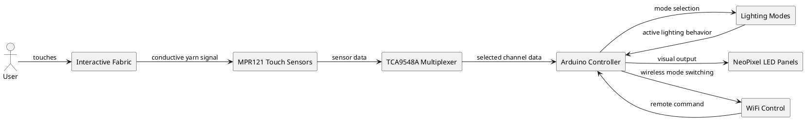

# Smart Fabric Bioluminescence System

This project implements an interactive textile lighting system that uses conductive yarn and MPR121 capacitive touch sensors to detect user interaction and map it to a bioluminescent LED display.

## System Overview

The system combines:
- conductive textile input
- MPR121 capacitive sensing
- TCA9548A multiplexing
- Arduino-based control logic
- NeoPixel LED output
- optional WiFi-based mode switching

## PlantUML Diagram

The diagram below shows the main system structure and relationships between hardware and software components.

## Project Structure

- `BioLuminiscence/BioDecay/bioluminescence/` contains the Arduino project files
- `ProjectConfig.h` defines hardware mapping and lighting geometry
- `bioluminescence.ino` contains the main runtime logic
- `WiFiController.h` handles remote mode switching
- `ModeController` and sensor classes manage the interaction system

## Purpose

The system turns a soft fabric surface into an interactive input medium. Touching the conductive yarn changes capacitance, which is detected by the MPR121 sensors and translated into dynamic lighting effects on the LED panels.

## Notes

This project is intended for prototyping and experimentation with interactive textile interfaces and responsive bioluminescent output.
